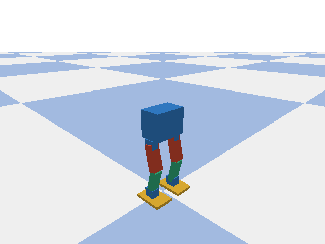

# SG90 十舵机二足机器人强化学习

这是一个可在 macOS 上运行的 PyBullet + Gymnasium + Stable-Baselines3 项目，用 SAC 学习小型二足机器人的步态。执行器模型按 SG90/MG90S 类 9g 舵机做了保守的力矩、速度和动作限幅。

当前设计目标是先做轻量实物，再做 sim-to-real。普通 SG90 的扭矩会受电压、温度、安装角度、电池电量和机械摩擦影响，仿真参数必须在实物完成后重新标定。

## 机器人设计

每条腿 5 个自由度，共 10 个舵机：

| 关节 | 作用 |
| --- | --- |
| `hip_roll` | 左右方向的重心控制 |
| `hip_pitch` | 大腿前后摆动 |
| `knee` | 膝关节弯曲 |
| `ankle_pitch` | 脚掌前后调平 |
| `ankle_roll` | 脚掌左右调平 |

参考参数集中在 [robot_config.py](robot_config.py)：大腿和小腿各约 55 mm，髋部间距约 60 mm，标称总质量约 250 g，单关节假设最大约 0.08 N·m、速度约 6 rad/s。仿真使用 500 Hz 物理步进、50 Hz 控制频率。策略输出 10 个关节的有界残差，基础步态由 [envs/gait.py](envs/gait.py) 生成。




## macOS 安装

建议 Python 3.10–3.12：

```bash
cd /Users/lvshaofei/Documents/ChatGPT/robotRL
python3 -m venv .venv
source .venv/bin/activate
python -m pip install --upgrade pip
python -m pip install -r requirements.txt
```

检查 PyTorch 是否能使用 Apple MPS：

```bash
python - <<'PY'
import torch
print("PyTorch:", torch.__version__)
print("MPS available:", torch.backends.mps.is_available())
PY
```

这个项目的 MLP 很小，默认使用 CPU 通常更稳定。需要时可以显式指定 `--device mps`。

## 先检查和预览

完整回归测试：

```bash
python -m unittest discover -s tests -v
```

预览零残差参考步态并导出 GIF（当前默认目标速度 0.04 m/s、步幅约 21 mm、抬脚 14 mm、横向摆幅 16 mm）：

```bash
python scripts/preview.py --gif /tmp/reference_gait_elegant.gif
```

直接打开 PyBullet GUI：

```bash
python scripts/preview.py
```

## 训练

先跑小实验确认环境：

```bash
python train_sac.py \
  --steps 50000 \
  --eval-freq 5000 \
  --eval-episodes 10 \
  --run-dir runs/smoke
```

训练器使用“参考步态 + SAC 残差”：基础动作由逆运动学参考轨迹提供，策略学习平衡和推进修正。当前残差范围已收紧，训练开始前会用零残差参考动作填充经验池，再用低探索熵更新策略，避免随机动作破坏步态。奖励还会直接惩罚机身俯仰角、俯仰速度、横滚角和横滚速度，评估结果会记录机身俯仰/横滚峰值。默认使用 `2e-5` 学习率、1,000,000 条经验池、每收集 8 步只做 1 次梯度更新、目标熵 `-8`，以及连续三次评估达到 80% 步行成功率后早停。每次评估默认 10 个不同随机种子 episode，`best.json` 指向质量最好的 checkpoint，`final` 只表示最后一次更新，不一定最好。

机器人起步时用 `0.3` 秒从双脚站立姿态平滑过渡到完整参考步态，兼顾响应速度和 9g 舵机的实际动作能力。

新建直线行走训练建议至少从 600,000 步开始。训练器默认使用已经验证过的 `target_speed=0.04`；改变速度或步态参数后必须新建运行目录，不能加载旧模型：

```bash
python train_sac.py \
  --steps 800000 \
  --imu bno085 \
  --learning-starts 0 \
  --target-entropy -8 \
  --reference-warmup-steps 10000 \
  --eval-freq 10000 \
  --eval-episodes 10 \
  --run-dir runs/walk_reference_elegant
```

Apple Silicon 上确认 MPS 可用后（这个小网络通常 CPU 更稳定）：

```bash
python train_sac.py --device mps --steps 800000 --target-speed 0.04 --learning-starts 0 --target-entropy -8 --reference-warmup-steps 10000 --run-dir runs/walk_reference_elegant_mps
```

加入质量、摩擦、舵机强度、延迟和 IMU 噪声随机化，提高迁移鲁棒性：

```bash
python train_sac.py \
  --steps 800000 \
  --randomize \
  --eval-freq 20000 \
  --run-dir runs/walk_sg90_randomized
```

每个运行目录会保存 `final/model.zip`、`final/vecnormalize.pkl`、`final/replay_buffer.pkl`、`final/config.json`、`final/evaluation.json`，以及中间 checkpoint、`evaluations.jsonl` 和 `best.json`。

`best.json` 是自动选择的最佳评估 checkpoint，按步行成功率、摔倒率、直线效率、侧偏、航向误差和机身俯仰/横滚排序。`final` 只是最后一次更新，训练后演示应使用 `best.json`：

```bash
python test.py \
  --model runs/walk_fast_start03/final \
  --episodes 10 \
  --output runs/walk_fast_start03/verification.json

python test.py --model runs/walk_fast_start03/final --episodes 1 --gui
```

## 续训和评估

使用带 replay buffer 的 bundle 续训。只有当仿真指纹和任务参数没有变化时才使用 `--resume`；修改步态周期、抬脚高度或目标速度后请重新训练：

```bash
python train_sac.py \
  --resume runs/walk_fast_start03/final \
  --steps 400000 \
  --run-dir runs/walk_fast_start03_resume
```

如果仿真没有变化、已知某个中间 checkpoint 的动作最好，但它没有 `replay_buffer.pkl`，可以使用策略热启动。它会加载 actor/critic 和归一化统计量，重新建立经验池，并先由已有策略采集 10,000 条正常步态经验：

```bash
python train_sac.py \
  --init-model runs/walk_fast_start03/best.json \
  --steps 400000 \
  --eval-freq 10000 \
  --eval-episodes 10 \
  --run-dir runs/walk_fast_start03_finetune
```

`best.json` 会自动解析到它记录的最佳 checkpoint。也可以直接填 `step_000440000` 这样的目录。不要从已经退化的 `final` 继续训练。旧的 `walk_bno085`/`walk_bno087` 模型使用旧步态指纹，不能作为当前抬脚/摆幅版本的 `--init-model` 起点。

加 `--require-walking` 可以让命令在没有任何成功步行 episode 时返回退出码 1。评估的 `walking_success` 同时检查未摔倒、平均速度、全程最大侧偏不超过 10 cm、全程最大航向误差不超过 25°、机身最大俯仰/横滚不超过 15°、路径直线率不低于 80%，以及双脚抬脚/触地次数，不能只看 reward。

旧模型（包括 `resume3`）如果来自不同步态参数，仍不能加载到当前版本。当前代码的 simulator fingerprint 会阻止误用旧模型；看到 `Simulator changed since training` 时，请用上面的新建训练命令。旧的 `walk_bno085/best.json` 可在旧基线代码下回放，新版本训练应使用新的运行目录。

## 实物制作建议

四舵机模型缺少左右重心控制，建议按当前十舵机结构制作。舵机使用独立 5 V 电源，额定电流建议至少 3 A；舵机电源地必须和主控 GND 共地，不要从开发板的小电流 5 V 接口给十个舵机供电。

首次上电时把舵机动作限制在中位附近，逐个确认零位、方向和机械干涉。实物使用一个 BNO085，不需要再安装 MPU6050。BNO085 提供加速度计、陀螺仪、磁力计和板载姿态融合；策略使用其重力方向、角速度和航向误差，并结合步态相位、速度指令和舵机指令历史。普通 9g 舵机通常没有对主控开放的位置反馈。连接真实舵机前，要测量整机质量、站立电流、单腿抬脚力矩和低电压下的舵机速度。

修改尺寸或质量后重新生成 URDF 并测试：

```bash
python scripts/build_urdf.py
python -m unittest discover -s tests -v
```

## 代码结构

| 文件 | 用途 |
| --- | --- |
| [robot_config.py](robot_config.py) | 尺寸、质量、力矩和速度假设 |
| [scripts/build_urdf.py](scripts/build_urdf.py) | 从配置生成十舵机 URDF |
| [biped.urdf](biped.urdf) | PyBullet 模型 |
| [envs/gait.py](envs/gait.py) | 参考步态和腿部逆运动学 |
| [envs/biped_env.py](envs/biped_env.py) | 环境、接触、奖励和跌倒判定 |
| [training.py](training.py) | bundle、VecNormalize 和评估 |
| [train_sac.py](train_sac.py) | 训练、评估 checkpoint、最终保存 |
| [test.py](test.py) | 独立评估和 GUI 回放 |
| [tests/](tests/) | 环境和训练烟测 |

## 验证结论

本版本在 macOS 上已通过 14 项自动检查，包括 Gymnasium/SB3 环境契约、BNO085 航向反馈、随机种子、独立物理客户端、舵机限幅、左右残差接口、跌倒与超时区分、随机化 reset、直线轨迹约束、渲染、模型保存/恢复、参考步幅和 replay buffer 续训。新的零残差参考步态在仿真中连续运行 12 秒，约前进 0.34 m、最大横向偏移约 6 cm、最大航向误差约 24° 且不摔倒。SAC 正式训练要以 `best.json` 的评估结果为准。
